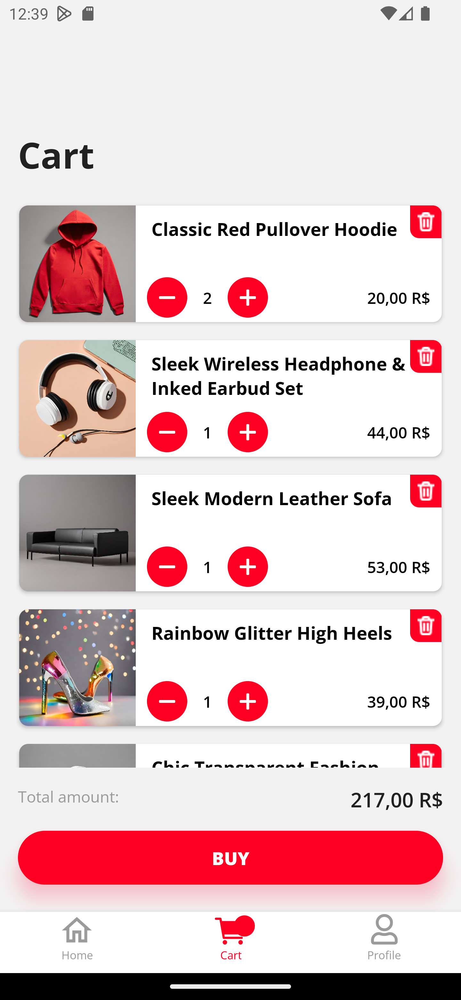

# E-COMMERCE COMPRASS

## Description
This project is a traditional e-commerce app developed using TypeScript, React Native, and the Expo framework. The app allows users to browse items, view product details, search for specific items by name, and manage their shopping cart. Users can add items to the cart, increase item quantities, or remove items from the cart. While the app can be used without an account, users need to be registered and logged in to complete a purchase.

## Link to the YouTube video of app demonstration:
<a href="https://youtu.be/Qd6Q5CPupE0">
  
</a>

## Features
- **Product Browsing:** Navigate through the available items.
- **Product Details:** Click on an item to view detailed information about the product.
- **Search:** Search for specific items by name.
- **Shopping Cart:** Add items to the cart, adjust quantities, and remove items.
- **Authentication:** Sign up, log in, and reset password.
- **Checkout:** Choose shipping address, payment method, and review the order total (including shipping).
- **Order Completion:** After completing the purchase, users are directed to a success page with payment details.
- **Persistent Login:** Authentication persists in the app, so if the user closes the app on their device, they remain logged in when reopening the app.

## Technologies Used

<span>
  <a href="https://www.typescriptlang.org/">
    
  </a>
  <a href="https://reactnative.dev/">
    
  </a>
  <a href="https://docs.expo.dev/">
    
  </a>
</span>

- **TypeScript:** Ensuring robust and type-safe code.
- **React Native:** Building the mobile app.
- **Expo:** Framework for developing React Native apps.
- **React Native Async Storage:** Storing data locally.
- **React Navigation:** Managing app navigation.
- **React Redux & Redux Toolkit:** Managing application state to improve performance and avoid unnecessary re-renders.
- **React Context:** Initial state management solution.
- **Jest & React Native Testing Library:** Unit testing.
- 
## Branch Structure
The repository uses a branch structure to separate different stages of the project:

```plainText
│
├─ main
├─ feat/cart-react-context
└─ feat/cart-redux
```

- **main:** Used to present the project.
- **feat/cart-react-context:** The initial version of the app using React Context for state management. Encountered performance issues due to unnecessary re-renders.
- **feat/cart-redux:** An improved version of the app using React Redux for state management, resolving the performance issues.

## Folder structure
Each folder structure is shown in the respective branch.

## Dependencies
To run this project, you need to have the following dependencies installed:
- Node.js version 20.5.1 or later.
- Either an Android or iOS emulator configured on your computer or the Expo Go app installed on your mobile device.

## Installation
To run the project locally, follow these steps:

1. Clone the repository to your local machine.
   
```bash
git clone https://github.com/PepeTonin/ecommerce-comprass.git
```

2. Navigate to the project directory.

```bash
cd ecommerce-comprass
```

3. Choose a branch to test. It is recommended to use the feat/cart-redux branch.

```bash
git checkout feat/cart-redux
```

4. Install the necessary dependencies.

```bash
npm install
# or
yarn install
```

5. Start the project.

```bash
npx expo start
```

6. Follow the steps in the terminal to run the project on an emulator or your mobile device.


